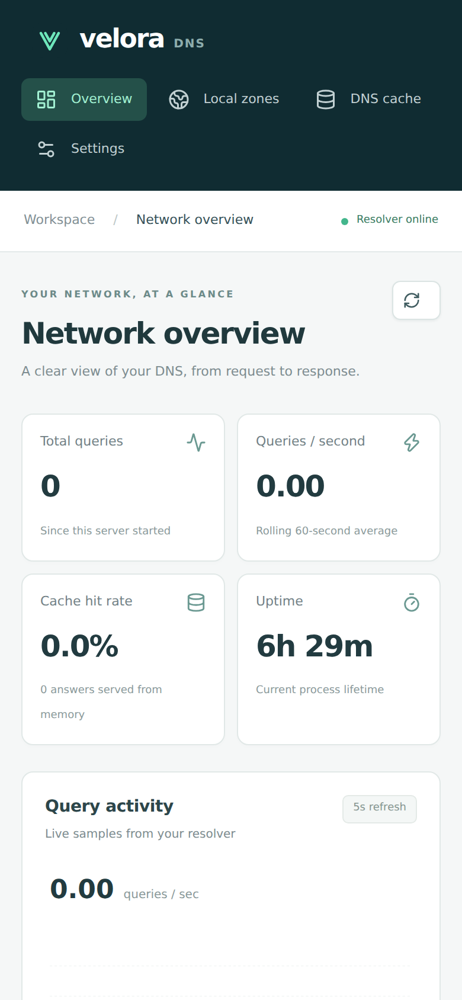
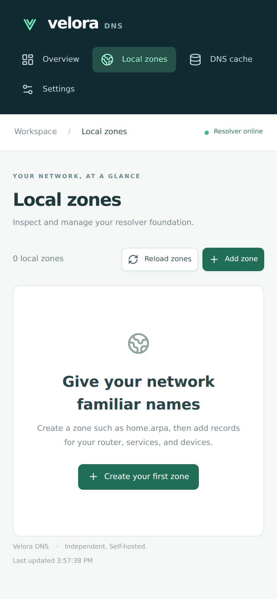
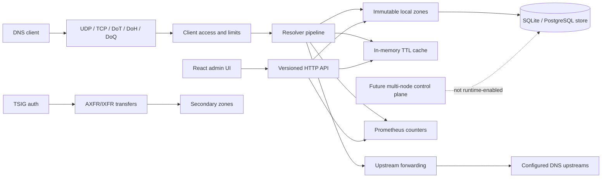

# Velora DNS


**Your DNS. Under your control.**

Velora DNS is an independent, self-hosted DNS server built in Go, with a clean React management interface. It combines UDP/TCP forwarding, a bounded in-memory cache, and operational visibility in one small service.

[](https://github.com/matta813/velora-dns/actions/workflows/ci.yml)
[](https://github.com/matta813/velora-dns/actions/workflows/codeql.yml)
[](LICENSE)

## Quick start

Choose one installation path. Both installers create the initial `admin` account with a
generated password unless you provide
`VELORA_BOOTSTRAP_PASSWORD`; save the printed password immediately.

### Docker Compose (Debian or Ubuntu)

On Debian or Ubuntu, this single command downloads Velora DNS, installs Docker Engine and
its Compose plugin when needed, then builds and starts the hardened local Compose
configuration:

```bash
curl -fsSL https://raw.githubusercontent.com/matta813/velora-dns/main/scripts/install-compose.sh | sh
```

The checkout is stored in `/opt/velora/compose`; set `VELORA_INSTALL_DIR` before the
command to use a different empty directory. To review or customize the source first,
clone the repository and run `./scripts/install-compose.sh` from its root.

### Direct system installation (systemd Linux)

On Debian or Ubuntu, this single command downloads Velora DNS and installs Go 1.27.1+,
Node.js 24+, npm and the systemd service. It then builds the application, creates a
dedicated `velora` service account, and starts DNS on port 53:

```bash
curl -fsSL https://raw.githubusercontent.com/matta813/velora-dns/main/scripts/install-system-bootstrap.sh | sh
```

The source checkout is stored in `/opt/velora/source`; set `VELORA_INSTALL_DIR` before
the command to use a different empty directory. For a manually prepared development
environment, run `./scripts/install-system.sh` from a local checkout instead.

Both paths bind DNS and the management UI to loopback by default. Open
[localhost:8080](http://localhost:8080). For the direct system install, verify DNS and
readiness with:

```bash
dig @127.0.0.1 -p 53 google.com A
dig @127.0.0.1 -p 53 google.com A +tcp
curl http://127.0.0.1:8080/ready
```

The Compose service uses host port `5353`, so use `dig @127.0.0.1 -p 5353 google.com A`
instead. For LAN access, standard ports with Compose, upgrades and backups, read the
[deployment guide](docs/deployment.md). Never expose a recursive resolver before
restricting its client CIDRs and host firewall.


<p align="center">
  
  &nbsp;&nbsp;
  
</p>

[Quick start](#quick-start) · [Documentation](docs/README.md) · [Roadmap](docs/roadmap.md) · [Discussions](https://github.com/matta813/velora-dns/discussions)

> **Development foundation, not a production release.** Forwarding, cache, lifecycle, authenticated operational API, dashboard, SQLite/PostgreSQL persistence, local authoritative zones, secondary zones with AXFR/IXFR transfers, TSIG authentication, blocklists, opt-in query history, metrics, DNS-over-TLS, DNS-over-HTTPS, DNS-over-QUIC, DNSSEC validation, users/roles, API tokens and zone import/export are implemented. Multi-node and PostgreSQL primary/replica cluster packages are experimental scaffolding and are not connected to the production runtime. No releases or published images have been created.

For a cache demonstration, send the same query twice with `+nocookie`; requests carrying client-specific EDNS options intentionally bypass the shared cache. Optional [query history](docs/query-logging.md) is available in the dashboard; set `VELORA_QUERY_LOG_ENABLED=true` before a Compose start to retain future queries with bounded age and row count.

## Capabilities

- UDP, TCP, DNS-over-TLS, DNS-over-HTTPS and DNS-over-QUIC listeners
- A, AAAA, CNAME, TXT, MX, NS and PTR forwarding with configured upstream ordering
- Per-attempt timeout, retries, TCP fallback after truncation and UDP-to-TCP fallback
- Positive and RFC 2308 negative-answer LRU cache with TTL aging, expiry, capacity limits and API flush
- Strict YAML configuration and explicit environment overrides
- Client CIDR allowlisting, bounded concurrent DNS/HTTP requests and safe loopback defaults
- Structured JSON lifecycle logs, context cancellation and graceful shutdown
- Local authoritative A, AAAA, CNAME, TXT, MX, NS and PTR records, generated SOA and negative answers
- Secondary zones with AXFR/IXFR transfer client and TSIG authentication (HMAC-SHA256/1/512)
- SQLite and PostgreSQL management storage with transactional migrations and revision-safe record updates
- Users, roles (admin/operator/viewer), scoped API tokens and session-based management access
- DNSSEC validation with operator-managed DS trust anchors
- Zone import/export (zone-file format)
- Versioned zones, records, status, stats, config and cache API; liveness and dependency readiness
- Responsive overview, zone/record management, cache management and read-only settings; live data and error states
- Prometheus metrics without domain or client labels
- Experimental, non-runtime scaffolding for future node membership, replication and PostgreSQL primary/replica routing
- Protected PR workflow, Dependabot, CodeQL, dependency review, static analysis and Docker CI

The server forwards recursive requests to configured upstreams and can perform local DNSSEC validation with operator-managed DS trust anchors. It does not perform iterative resolution. Client-option-dependent queries bypass shared caching and client EDNS metadata is not forwarded. Query names and client addresses are persisted only when the opt-in, bounded query log is enabled.

## Architecture



Velora owns the resolution pipeline. Libraries provide DNS wire parsing and transport, SQL access and HTTP infrastructure. Cache never depends on SQL. SQLite or PostgreSQL stores local zones and records; immutable snapshots serve DNS requests without database reads. Secondary zones can pull zone data from primary servers via AXFR/IXFR with TSIG authentication. The production runtime is currently single-node. See [local zones](docs/zones.md) for supported records and revision-safe API examples. Package responsibilities and extension points are documented in [architecture decisions](docs/architecture/0001-foundation.md).

### Local zone management

Open **Local zones** to create a zone and add, edit or delete its records. Changes take effect after successful persistence. Conflicting edits preserve your draft and require a reload.


## Configuration

Defaults support an unprivileged local start:

```yaml
dns:
  listen: ['127.0.0.1:5353']
  upstreams: ['1.1.1.1:53', '9.9.9.9:53']
  allowed_clients: ['127.0.0.0/8', '::1/128']
  timeout: 2s
  retries: 1
  max_concurrent: 256
cache:
  max_entries: 10000
http:
  listen: '127.0.0.1:8080'
  web_dir: web/dist
  allowed_hosts: ['localhost', '127.0.0.1', '::1']
database_path: data/velora.db
log_level: info
```

Use `-config configs/config.yaml` to load a file. Every exposed setting has an explicit `VELORA_*` override; see [configuration reference](docs/configuration.md). Invalid addresses, unknown YAML fields and unsafe resource bounds fail at startup.

## Development

Requires Go 1.27.1+, Node.js 24+ and npm:

```bash
npm --prefix web ci
make build
./bin/velora-dns -config configs/config.example.yaml
```

For hot reload, run `make backend` and `make frontend` in separate terminals; Vite proxies the API to the Go process.

```bash
make go-tools
make check
```

Tests use local upstreams and nonprivileged ephemeral ports. Public DNS access is only needed for the manual `dig` smoke test. See [development](docs/development.md) for the checks and frontend conventions.

## Roadmap

The [roadmap](docs/roadmap.md) separates implemented capabilities from the full MVP. Phase 1–3 features including encrypted DNS, DNSSEC, users/roles, PostgreSQL, secondary zones, TSIG, AXFR/IXFR, DoQ and API tokens are implemented. Phase 4 multi-node integration remains future work. Next: complete blocklist controls, DHCP server, multi-node runtime integration and production hardening.

## Security

The management API supports session-based authentication with admin/operator/viewer roles and scoped API tokens. Default configuration binds to loopback only. Do not expose recursive DNS to the internet. Client CIDRs remain enforced inside the DNS server; Docker network access and host firewall policy are separate controls. See [SECURITY.md](SECURITY.md) for reporting and [deployment hardening](docs/deployment.md).

Release automation is prepared but explicitly disabled. Normal development does not create release tags, GitHub releases or registry images. See [release process](docs/releases.md).
