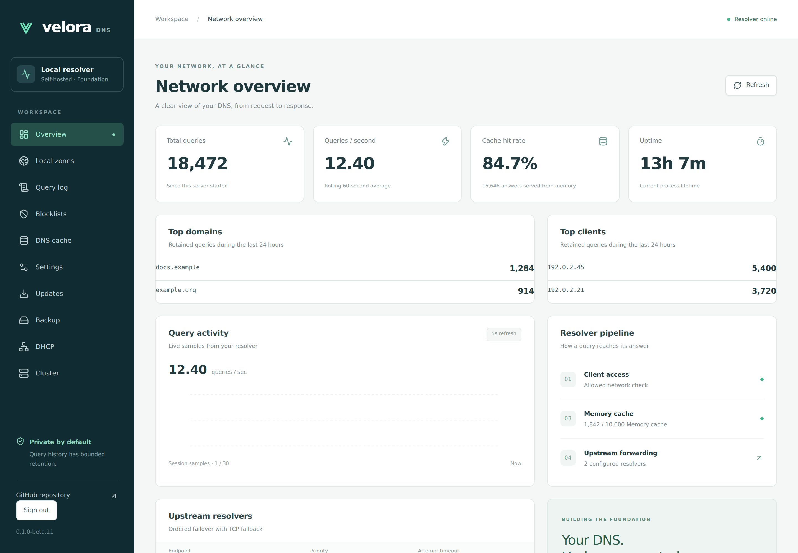
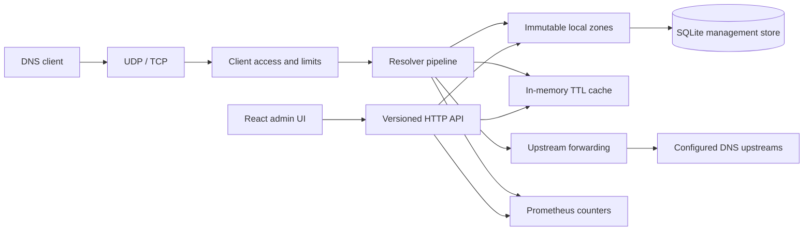
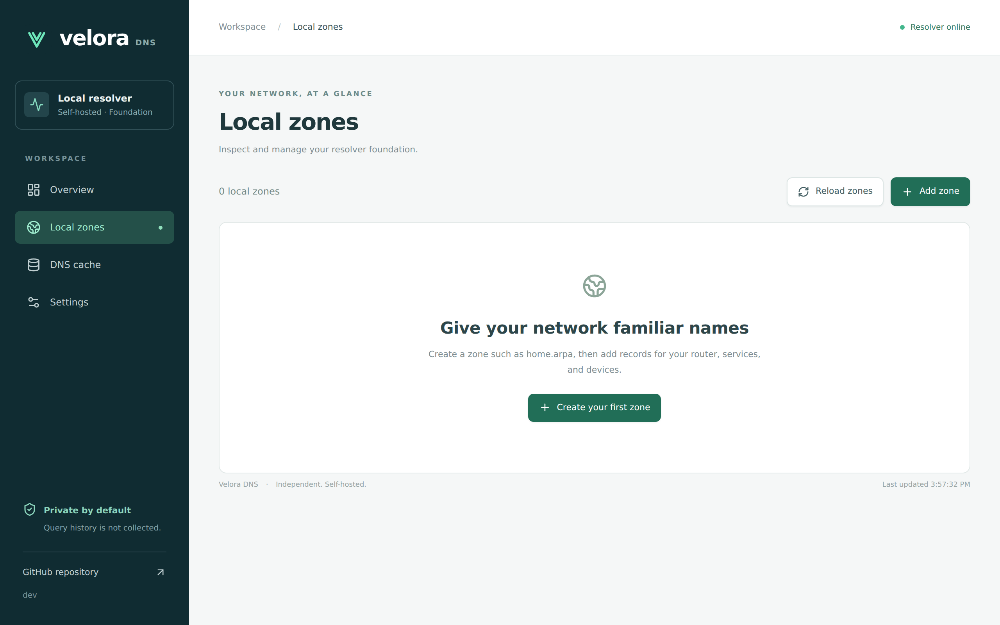

# Velora DNS


**Your DNS. Under your control.**

Velora DNS is an independent, self-hosted DNS server built in Go, with a clean React management interface. It combines UDP/TCP forwarding, a bounded in-memory cache, and operational visibility in one small service.

[](https://github.com/matta813/velora-dns/actions/workflows/ci.yml)
[](https://github.com/matta813/velora-dns/actions/workflows/codeql.yml)
[](LICENSE)



[Quick start](#quick-start) · [Documentation](docs/README.md) · [Roadmap](docs/roadmap.md) · [Discussions](https://github.com/matta813/velora-dns/discussions)

> **Development foundation, not a production release.** Forwarding, cache, lifecycle, operational API, dashboard, SQLite persistence, local authoritative zones, initial blocklists, opt-in query history and metrics are implemented. Authentication and encrypted DNS are planned. No releases or published images have been created.

## Quick start

Requires Docker Engine and Compose v2:

```bash
git clone https://github.com/matta813/velora-dns.git
cd velora-dns
docker compose up --build -d
```

Open [localhost:8080](http://localhost:8080). Test both DNS transports:

```bash
dig @127.0.0.1 -p 5353 google.com A
dig @127.0.0.1 -p 5353 google.com A +tcp
curl http://127.0.0.1:8080/ready
```

For a cache demonstration, send the same query twice with `+nocookie`; requests carrying client-specific EDNS options intentionally bypass the shared cache.

Optional [query history](docs/query-logging.md) is available in the dashboard. Start Compose
with `VELORA_QUERY_LOG_ENABLED=true docker compose up --build -d` to retain future queries
with bounded age and row count.

The Compose file builds locally, publishes only on host loopback, runs as UID 10001, drops capabilities and mounts a persistent data volume. Nothing is pulled from an unpublished project registry. See [deployment](docs/deployment.md) for LAN access, standard port 53, upgrades and backup.

## Capabilities

- UDP and TCP listeners; A, AAAA, CNAME, TXT, MX, NS and PTR forwarding
- Configured upstream ordering, per-attempt timeout, retries and TCP fallback after truncation
- Positive and RFC 2308 negative-answer LRU cache with TTL aging, expiry, capacity limits and API flush
- Strict YAML configuration and explicit environment overrides
- Client CIDR allowlisting, bounded concurrent DNS/HTTP requests and safe loopback defaults
- Structured JSON lifecycle logs, context cancellation and graceful shutdown
- Local authoritative A, AAAA, CNAME, TXT, MX, NS and PTR records, generated SOA and negative answers
- SQLite management storage with transactional migrations and revision-safe record updates
- Versioned zones, records, status, stats, config and cache API; liveness and dependency readiness
- Responsive overview, zone/record management, cache management and read-only settings; live data and error states
- Prometheus metrics without domain or client labels
- Protected PR workflow, Dependabot, CodeQL, dependency review, static analysis and Docker CI

The foundation forwards recursive requests to configured upstreams. It does not perform iterative resolution or DNSSEC validation, and clears upstream AD assertions. Client-option-dependent queries bypass shared caching and client EDNS metadata is not forwarded. Query names and client addresses are persisted only when the opt-in, bounded query log is enabled.
The foundation forwards recursive requests to configured upstreams. It does not perform iterative resolution or DNSSEC validation, and clears upstream AD assertions. Negative responses and client-option-dependent queries are not cached yet. Query names and client addresses are persisted only when the opt-in, bounded query log is enabled.

## Architecture



Velora owns the resolution pipeline. Libraries provide DNS wire parsing and transport, SQL access and HTTP infrastructure. Cache never depends on SQL. SQLite stores local zones and records; immutable snapshots serve DNS requests without database reads. See [local zones](docs/zones.md) for supported records and revision-safe API examples. Package responsibilities and extension points are documented in [architecture decisions](docs/architecture/0001-foundation.md).

### Local zone management

Open **Local zones** to create a zone and add, edit or delete its records. Changes take effect after successful persistence. Conflicting edits preserve your draft and require a reload.



## Configuration

Defaults support an unprivileged local start:

```yaml
dns:
  listen: ['127.0.0.1:5353']
  upstreams: ['1.1.1.1:53', '9.9.9.9:53']
  allowed_clients: ['127.0.0.0/8', '::1/128']
  timeout: 2s
  retries: 1
  max_concurrent: 256
cache:
  max_entries: 10000
http:
  listen: '127.0.0.1:8080'
  web_dir: web/dist
  allowed_hosts: ['localhost', '127.0.0.1', '::1']
database_path: data/velora.db
log_level: info
```

Use `-config configs/config.yaml` to load a file. Every exposed setting has an explicit `VELORA_*` override; see [configuration reference](docs/configuration.md). Invalid addresses, unknown YAML fields and unsafe resource bounds fail at startup.

## Development

Requires Go 1.27.1+, Node.js 24+ and npm:

```bash
npm --prefix web ci
make build
./bin/velora-dns -config configs/config.example.yaml
```

For hot reload, run `make backend` and `make frontend` in separate terminals; Vite proxies the API to the Go process.

```bash
make go-tools
make check
```

Tests use local upstreams and nonprivileged ephemeral ports. Public DNS access is only needed for the manual `dig` smoke test. See [development](docs/development.md) for the checks and frontend conventions.

## Roadmap

The [roadmap](docs/roadmap.md) separates implemented capabilities from the full MVP. Next: complete blocklist controls and top-domain/client statistics. Later phases add users/roles, PostgreSQL, DoT/DoH/DNSSEC, DHCP/DoQ and multi-node operation.

## Security

The management API currently has no authentication. Keep it on loopback or a trusted management network. Do not expose it or recursive DNS to the internet. Client CIDRs remain enforced inside the DNS server; Docker network access and host firewall policy are separate controls. See [SECURITY.md](SECURITY.md) for reporting and [deployment hardening](docs/deployment.md).

Release automation is prepared but explicitly disabled. Normal development does not create release tags, GitHub releases or registry images. See [release process](docs/releases.md).
