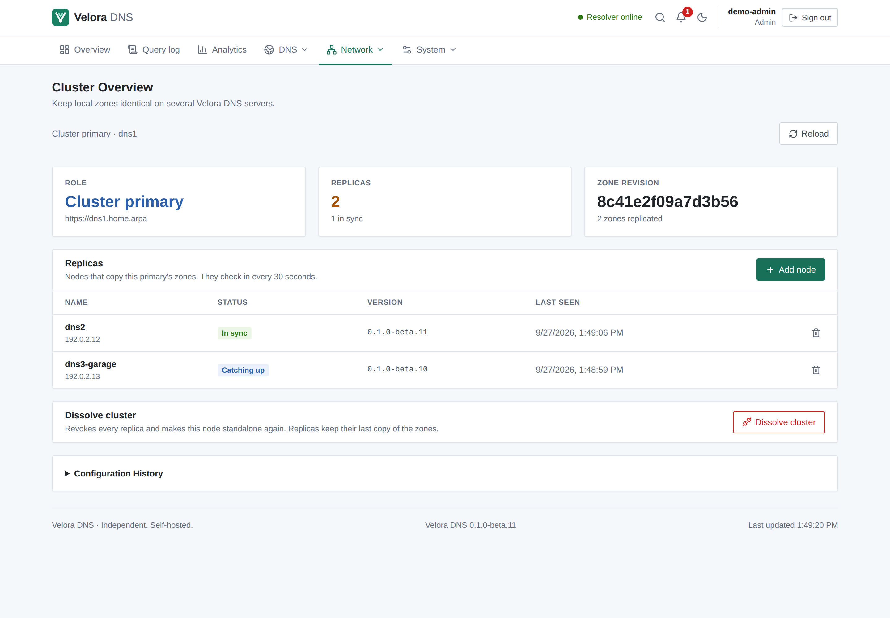

# Clustering: primary and replicas

A Velora DNS cluster keeps **local authoritative zones and their records**
identical on several servers, so clients can use more than one resolver for
your internal names. It is set up entirely in **Network → Cluster**.

## How it works

- One node is the **primary**. Zone changes are made there, as before.
- **Replicas** pull a signed snapshot of the primary's zones every 30 seconds
  (or immediately with *Sync now*) and apply it. They reject local zone changes
  with `409 zones_managed_by_primary`, so there is always exactly one writer
  and replicas cannot drift apart.
- Each zone is replaced atomically on the replica. If applying fails, the
  previous revision stays marked as applied and the next sync retries.
- A replica keeps serving its last applied zones when the primary is
  unreachable (DNS keeps working; the page and a system event report the
  failed sync).

**What is not replicated:** blocklists, rewrites, forwarding rules, clients and
policies, upstreams, users and all other settings stay per node. Secondary
(AXFR) zones are managed by each node itself. There is **no automatic
failover**: if the primary is lost, zones cannot be changed until you promote a
node manually (leave the cluster on a replica, which makes it standalone and
editable, then create a new cluster from it). This follows the single-writer
rule in [ADR 0004](architecture/0004-high-availability.md); a quorum-based
control plane with automatic leader election is future work.

## Create a cluster

On the node that should be the primary, open **Cluster → Create a cluster**:

- **Node name** — shown on the other nodes.
- **Address other nodes use** — the web interface URL of this node as the
  replicas reach it, for example `https://dns1.example.lan`. Its host name must
  be listed in `http.allowed_hosts`.
- Velora checks that the address reaches this node before creating the cluster.
  Skip the check only if the address is valid from the replicas but not from
  the primary itself (for example with some NAT setups).

## Add a replica

1. On the primary, select **Add node**. A one-time **join token** (valid for 30
   minutes, shown only once) and the primary URL are displayed.
2. On the new node, open **Cluster → Join a cluster** and enter the primary
   URL, the token and a node name. Joining **replaces the new node's local
   zones** with the primary's.
3. Velora checks the address, the cluster protocol version and the token,
   then the node starts syncing. The primary lists it under *Replicas*.

Useful errors are shown for unreachable addresses, a host name missing from
`http.allowed_hosts`, TLS certificate problems, invalid or expired tokens,
different cluster protocol versions and node IDs that are already registered.

## Replica status on the primary

| Status | Meaning |
| --- | --- |
| In sync | Applied the primary's current zone revision |
| Catching up | Reachable but still on an older revision |
| Sync error | Reported an error while applying (shown in the list) |
| Not responding | Not seen for more than 90 seconds |
| Waiting for first sync | Joined but not synced yet |

Replicas also report their Velora version. Mixed versions work as long as the
cluster protocol matches; otherwise the join or sync explains which side to
update.

## Remove, leave and dissolve

- **Remove node** (primary): revokes the replica's credential. It stops
  receiving updates, keeps its last copy of the zones and shows that it was
  removed; leave the cluster there to edit zones locally again.
- **Leave cluster** (replica): tells the primary, becomes standalone and keeps
  its zones as local, editable zones.
- **Dissolve cluster** (primary): revokes every replica and makes the primary
  standalone again.
- The primary cannot remove itself.

All cluster actions require an admin and are confirmed in the UI.

## Security

- Replicas authenticate with a per-node credential that the primary stores
  only as a hash. The join token is single-use, expires after 30 minutes and is
  stored only as a hash.
- Every snapshot is signed (HMAC-SHA-256) with a key derived from the
  credential; a replica refuses a snapshot whose signature does not match.
- Use **HTTPS** between nodes (for example through your reverse proxy). Plain
  HTTP sends the token and credential unencrypted and must be allowed
  explicitly with *Allow plain HTTP* on a trusted network.
- Node-to-node endpoints live under `/api/v1/cluster/peer/` and do not accept
  browser sessions; they still pass the `http.allowed_hosts` check.

Failed and recovered syncs raise the `cluster.sync_failed` and
`cluster.sync_recovered` system events, which can also be sent to
[webhooks](webhooks.md).
