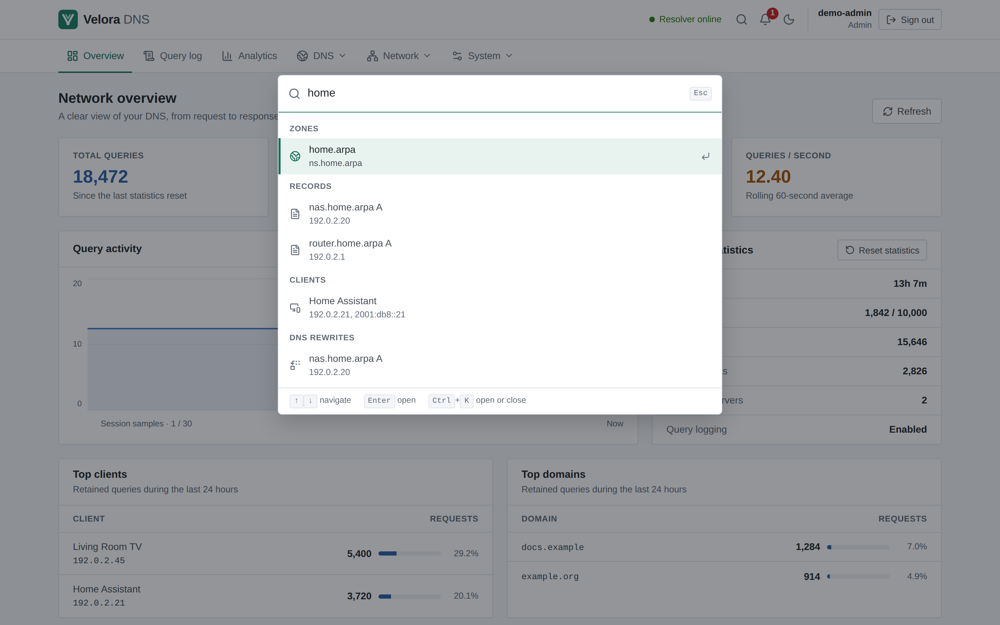

# Command palette

Press **Ctrl+K** (or **⌘K** on macOS), or select the search icon in the header, to
open the command palette from any page.

It lists, as you type:

- **Pages** — every page you can open, including grouped menu entries such as
  *Local zones* or *Client policies*. Admin-only pages appear only for admins.
- **Actions** — quick, safe shortcuts: switch the theme, check for updates,
  sign out, and for users who can make changes *Add a client* (opens the form)
  and, for admins, *Create a backup* (opens the backup page). Anything that
  changes data still happens on its page, with its usual confirmation; viewers
  get no write shortcuts.
- **Resources** — from two characters on, matching zones, records (name or
  value), clients (name, group or address), DNS rewrites, conditional
  forwarding rules and blocklists. Selecting one opens its page with the item
  selected or filtered.

Resource search runs on the server (`GET /api/v1/search`) after a short pause
in typing, returns at most five results per kind and scans a bounded number of
records, so large installations stay fast and the browser never downloads whole
datasets for searching. It only covers data the signed-in user can already
read, and never secrets such as TSIG keys, tokens or webhook URLs.

## Keyboard

| Key | Action |
| --- | --- |
| Ctrl/⌘+K | Open or close |
| ↑ / ↓ | Move through results |
| Home / End | First / last result |
| Enter | Open the highlighted result |
| Esc | Close and return focus to where you were |

The palette is a modal dialog with a combobox and a grouped listbox, so screen
readers announce the highlighted result while focus stays in the search field.
