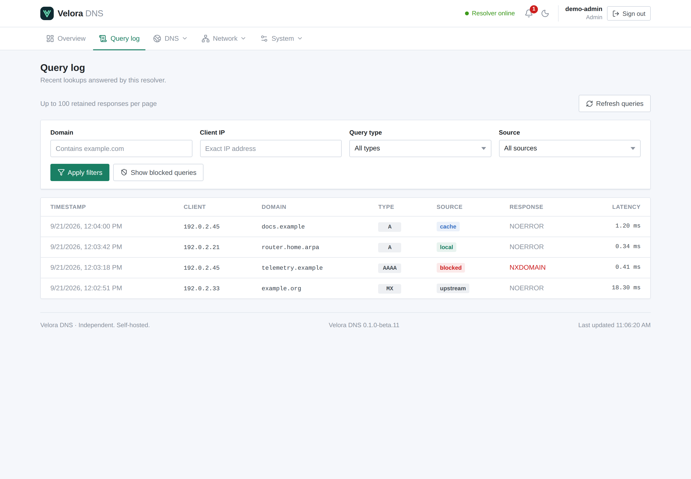

# Query history

Query logging is disabled by default. Enable it using YAML `query_log.enabled: true`
or `VELORA_QUERY_LOG_ENABLED=true`. Compose passes through this environment variable.
New queries are retained; enabling history does not reconstruct earlier traffic. When
logging is disabled, history and aggregate endpoints return an explicit unavailable
response and the UI does not display previously retained private activity.

The DNS handler enqueues timestamp, client IP, domain, type, response code, elapsed
time, source, upstream and cache-hit status without waiting for SQL. A single worker
writes batches of up to 128 records. The queue defaults to 1024 records. Overflow and
failed writes increment `dns_query_log_dropped_total`; failed write/retention operations
increment `dns_query_log_errors_total`. Delivery is best effort, not an audit guarantee.

Retention defaults to seven days and 100000 rows, whichever removes a record first.
The bounds apply transactionally on writes and every minute, including while recording
is disabled. SQLite reuses deleted pages; its file does not shrink after every purge.
The application stops DNS/HTTP before draining the queue, with a five-second drain deadline,
then closes SQLite. Abrupt termination can lose queued records.

Configuration:

| YAML | Environment | Default |
|---|---|---|
| query_log.enabled | VELORA_QUERY_LOG_ENABLED | false |
| query_log.queue_size | VELORA_QUERY_LOG_QUEUE_SIZE | 1024 |
| query_log.retention | VELORA_QUERY_LOG_RETENTION | 168h |
| query_log.max_rows | VELORA_QUERY_LOG_MAX_ROWS | 100000 |

Retention must be 1 minute–365 days; row capacity 1–1000000; queue capacity 1–100000.
The management API exposes these settings without exposing the database path.

## Read history

`GET /api/v1/queries` returns a JSON `data` array, including when empty.
Optional filters: `domain` is a literal case-insensitive substring; `client` is an
exact IP; `type` and `source` are exact. `limit` defaults to 100 and is bounded at 500.
Results are ordered by descending insertion ID. Supply the last ID as `before` for
the next page. Invalid filters return 400.

Each entry uses snake_case keys: `id`, `occurred_at`, `client_ip`, `domain`, `type`,
`rcode`, `duration`, `source`, `upstream`, `cache_hit`. Time is UTC RFC3339; duration
is nanoseconds, matching other duration fields. The UI renders it in milliseconds.

The Query log page supports all four filters and older pages. History includes private
network activity: restrict access to the management interface and database backups.

## Aggregate dashboard

`GET /api/v1/query-stats` returns total and blocked counts plus top domains and clients.
`window` is restricted to `1h`, `24h` (the default), `7d` or `30d`; `limit` defaults to 10 and
is bounded at 50. Windows include their start and exclude their end. Rankings are computed
on demand over retained rows and use deterministic value ordering for ties. Domain and
client values are never exposed as Prometheus labels, avoiding unbounded metric cardinality.

## Analytics

The Analytics page (`GET /api/v1/analytics?range=`) turns retained history into
time series and breakdowns. It is aggregated in the database, so the browser receives a
fixed amount of data regardless of how many queries are stored:

| Range | Buckets |
| --- | --- |
| `1h` | 60 × 1 minute |
| `24h` (default) | 24 × 1 hour |
| `7d` | 168 × 1 hour |
| `30d` | 30 × 1 day (UTC) |

Each bucket and the window total report queries, blocked answers, cache answers, SERVFAIL
answers and the average upstream response time of answered queries. The response also
includes query types, response codes, answer sources, per-upstream usage with failures and
average response time, and the top blocked domains. Buckets are aligned to whole minutes,
hours or days, so the first bucket can start slightly before the nominal window.

Analytics only cover what query logging retains: `history_start` is the oldest stored query,
and the page says so when a range reaches further back than retention allows. With query
logging disabled, the endpoint returns `503 query_logging_disabled`. Analytics are
available to the same roles that can read the query log.
